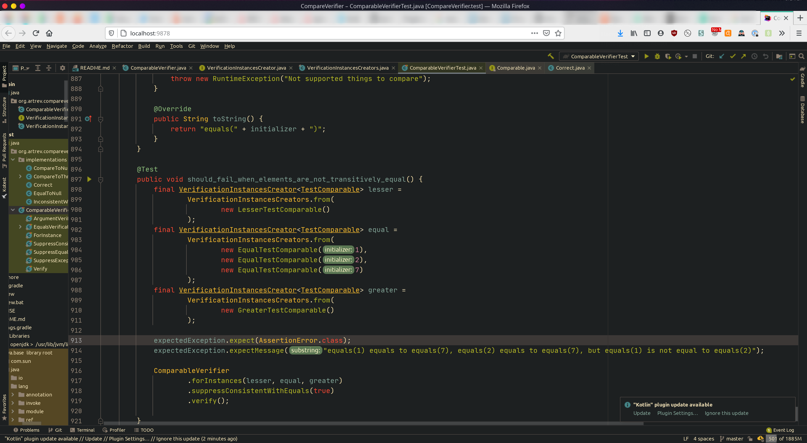

<!--
_class: lead
_paginate: false
-->

<style>
.hljs-variable { color: lightblue }
.hljs-string { color: lightgreen }
.hljs-params { color: lightpink }
</style>

# <!-- fit --> Projector: Your Remote IDE

Pasha Finkelshteyn, JetBrains

---

# <!-- fit --> Did you ever complain?

- You need to set up a VPN to access data?
- You need to use RDP to access your instance of IDEA?
- Or even VNC?
- *Long* indexing?
- Huge project compiles forever?


---

# Did you ever want?

- Edit code from tablet/smartphone?
- Help your colleague to fix some issues?
- Show demo which accesses data from your cloud?
- Work from a weak laptop?


---
<!--
_class: lead
-->


---

# Issues with existing solutions. VPN

1. OpenVPN does not scale
    1. No central identity management
    1. No failover OOTB
1. Proprietary solutions are… proprietary
1. And expensive sometimes
1. IKE is not completely cross-platform

---

# Issues with existing solutions. VNC

1. **Extremely** slow
2. Complex infrastructure (VPN?)

---

# Issues with existing solutions. RDP

RDP is awesome

1. Single-user
1. Requires special client
2. Still needs complex infrastructure to provide access

---


# Stop this

---

# Let's dig!


---

## Typical Swing interface


---

# And in reality?

- Lines
- Simple shapes
- Strings
- Fonts

---

# Swing architecture


---

# Definitions

**Toolkit** — abstraction over the whole graphics
**Heavyweight components** — system-controlled components
**Lightweight components** — user-controlled components
**Graphics2D** — drawing controller

---

# Types of drawing surfaces

- Visible
- Invisible
    Part of the editor which you don't see is separate and is drawn on an invisible surface

Each window has its own surface(s)

---

# Heavyweight components

There is a corresponding `Peer` class for each heavyweight component.

```java
interface ComponentPeer {
    void paint(Graphics g);
    void setBounds(int x, int y, int width, int height, int op);
    void handleEvent(AWTEvent e);
    void setBackground(Color c);
    void setFont(Font f);
    // etc.
```

Responds for delegation to Graphics and setting several params

---
<!-- _class: lead -->
# Heavyweight components

We have implementations of peers only for several heavyweight components.

---

# Graphics2D

*Anything* may contain Graphics2D

Responds for drawing:

```java
abstract class Graphics2D {
    public abstract void drawImage(BufferedImage img, 
                                   BufferedImageOp op,
                                   int x, int y);
    public abstract void drawString(String str, int x, int y);
    public abstract void fill(Shape s);
    // etc.
```

---


# How the hell will it work in a browser?

Welcome [DrawEventQueue](https://github.com/JetBrains/projector-server/blob/master/projector-awt/src/main/kotlin/org/jetbrains/projector/awt/service/DrawEventQueue.kt)

Queue, that will transform any action into event, based on

```java
ConcurrentLinkedQueue<List<ServerWindowEvent>>()
```

---

# `DrawEventQueue`

Each component hash its own queue (for now)

```java
private inline fun paintArea(
    crossinline command: DrawEventQueue.CommandBuilder.() -> Unit
) {
    drawEventQueue
        .buildCommand()
        .setClip(identitySpaceClip = identitySpaceClip)
        .setTransform(transform.toList())
        .setComposite(backingComposite)
        .command()
}
```

---

# So we have commands. Now what?

```java
while(!stopped){
    sendAllCommands()
    Thread.sleep(10)
}
```

Every 10ms (roughly) aggregate all commands and send them to the client over WebSocket.

---

# Format

Default format: highly optimized JSON
Supported OOTB formats: Protobuf, JSON
May support anything if the browser supports it.

---

# Backend

* Ktor?
* Tomcat?
* Undertow?
* Netty?
* Jetty?

---


---

# GPL is not always a good thing

Popular products are not compatible with it, and we HAVE TO publish source code under GPL license.

So…

## [TooTallNate/Java-WebSocket](https://github.com/TooTallNate/Java-WebSocket)

And a bunch of crutches to add HTTP support there.

---

# Clients

A client should implement ≈30 API methods of drawing

The good part of Kotlin: we can share some logic between client and server (and we do).

`kotlilnx.serialisazation` _may_ do things easier (but deserialization is sooo slow).

---

# In browser



---

# In client


---

# Desktop client

- Electron-based
- (Almost) all browser hotkeys are disables
- May me expanded to full screen

---
<!-- _footer: "" -->
# Installation: GNU/Linux

```bash
pipx install projector-installer
```


---

# Installation: Docker

[JetBrains/projector-docker](JetBrains/projector-docker)

```
docker pull \
    registry.jetbrains.team/p/prj/containers/projector-idea-u
docker run --rm -p 8887:8887 -it \
    registry.jetbrains.team/p/prj/containers/projector-idea-u

```

Preserve state?

`run-container-mounted.sh [containerName]` ← helper script

---